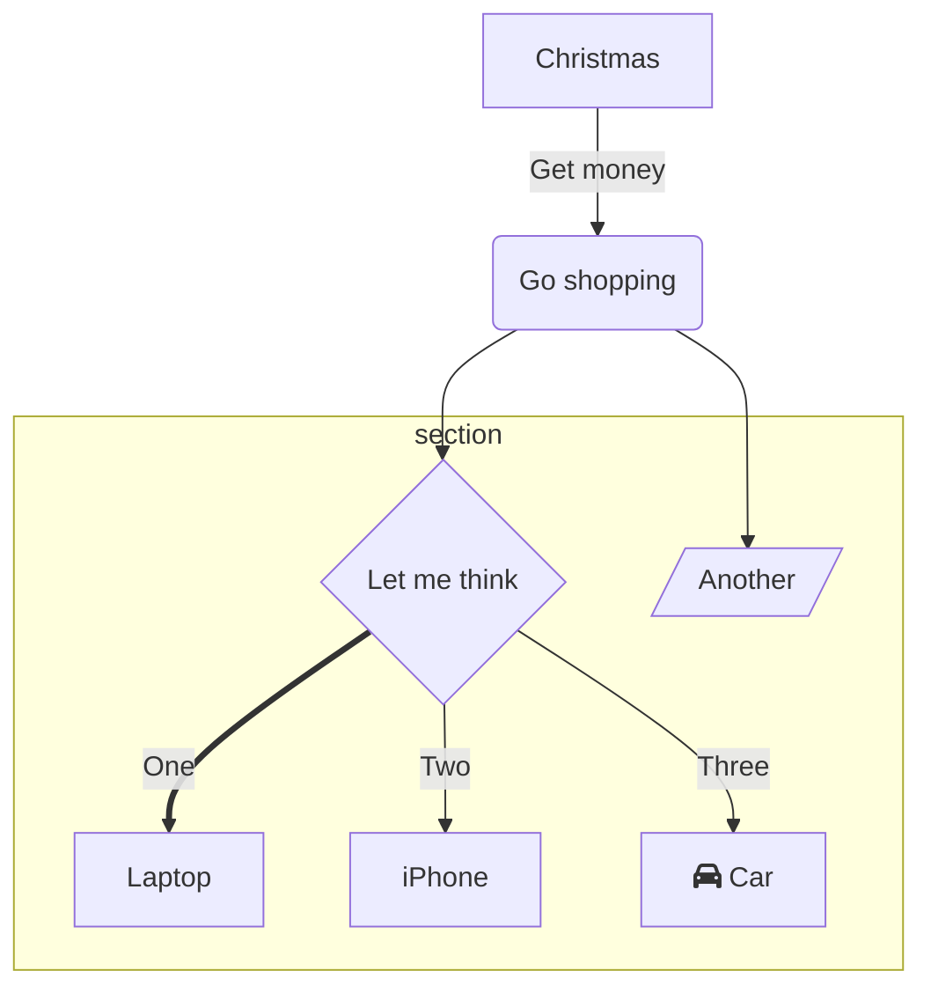

# Page header

Hello `inline`

<!-- 
 -->

[Download CV](/assets/ConnelHooleyCV.pdf)

``` csharp
public class Example
{

}
```


``` mermaid
graph TD
  A[Christmas] -->|Get money| B(Go shopping)
  B --> C{Let me think}
  B --> G[/Another/]
  C ==>|One| D[Laptop]
  C -->|Two| E[iPhone]
  C -->|Three| F[fa:fa-car Car]
  subgraph section
    C
    D
    E
    F
    G
  end
```
