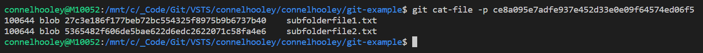

# Git Guide

---

This guide aims to introduce you to git and is targeted at devs who currently use TFVC

---

# Why is git popular?

- Better tooling support for non Visual Studio devs
- Better suited for open source development
- Better suited for feature branching
- The cost of supporting more than one VC system in build pipelines has resulted in products such as VSTS offering features in git before TFVC

<aside className="notes">

- I think the "new branches for user stories" feature in VSTS works in git but not TFVC

</aside>

---

Git is usually used from within your IDE but lets start off by running through some basic usage of git from the command line...

---

When using git the first thing you need to do is tell it who you are by using the **git config** command:


<small>

Normally your IDE does this for you

</small>

---

Lets make our current directory a git repository by running the **git init** command:


- Creates a hidden **.git** folder that git uses to store stuff
- Think of a **repository** as a TFVC workspace

---

Lets create a file in the workspace and put some text in it:


---

Now lets run **git status** to see the current status of our workspace:


- This command tells you which files are to be included in the next commit
- A **commit** is the same as a check-in apart from it is entirely local

---


- As you can see we now have untracked files:
- We need to **add** them to include them in our next commit (change set)

---

So lets do that:


Think of this as **including pending changes**

---

Now lets run **git status** again:


Now our changes are **committed** which means they will be in our next commit

---

Now lets run **git commit** to check in our changes


---

# Git Commit

Unlike TFVC where checking in sends the changes up to a remote server, git commits are entirely local

<small>

*We'll get to sending the changes to a remote server later*

</small>

---

Lets run **git log** to view our history of commits:


---


- Notice the hash written in yellow next to the word commit, this is the commit ID
- Think of this as a **change set ID**
- A commit ID is a SHA-1 hash

---

Lets decrypt the commit ID hash to see what's inside it using the **git cat-file** command:


- Everything here looks pretty standard apart from the tree which is another SHA-1 hash
- A **tree** is git speak for a directory
- This means the commit ID is a hash of a hash along side some metadata

---

Lets decrypt the tree SHA-1 hash:


- This tree contains a blob called helloworld.txt
- A **blob** is git speak for the contents of a file

---

Lets decrypt the blob SHA-1 hash:


As you can see it contains the file contents

---

# Git Object Hierarchy


<small>

It's hashes all the way down

</small>

---

Lets add some new files to our workspace:


---

Lets include them in our changes (add)  
and check them in (commit):


---

Lets view our history again


We now have 2 commits

---

Lets decrypt the latest commit ID to see what's inside it:


- This commit has a parent which is the previous commit
- This means that even if two workspaces contain the exact same files & folders, unless they share the exact same history and were created at the exact same time, their commit IDs will be different
- This means that if you commit some changes, then remove the changes and commit again, then the commit ID will be different despite the workspace being the same

---

Lets decrypt the tree to see what's inside it:


As you can see, trees can contain multiple files & directories just like the file system

---

Lets decrypt the new directory to see what's inside it:



The tree contains the new files as expected

---

For completeness lets just decrypt one of the new files:


---

# Git Object Hierarchy


---

Lets put the exact same content into 2 different files:


---

Running **git status** tells us we have unstaged changes:


You may notice that this run of git status talks about the files being unstaged as opposed to untracked like earlier...

---

# Untracked vs unstaged

- An **untracked** file is a brand new file that has been newly created
- An **unstaged** file is a file that has been previously committed, but has since been modified
- This is always abstracted away from you by your IDE so don't worry about it too much

---
  
Adding the files includes them in our commit:


In git land this is usually called **staging** your changes

---

Lets commit our changes:


---

We can now see our history contains 3 commits:


---

Lets view our new object tree in the terminal:


- Note how both subfolderfile1.txt and subfolderfile2.txt have the exact **same** hash
- This demonstrates how efficient git is when storing files locally

---

# Git Object Tree


---

Lets look at actually where git stores these objects on the disk


---

# Storage

- Git stores files in the hidden directory. They are placed in:
  - A directory that is named after the first 2 letters of the hash
  - A file that is named after the subsequent 38 character of the hash
- The object files in the hidden directory are compressed so cannot be opened without using special git commands

---

You may have noticed that the blob hash for the original helloworld.txt never changed during any of the commits

This means that every commit represents a snapshot of all the files on the disk during the time of the commit, but the same file contents is never stored twice

---

Lets look at working with remote servers...

---

It is possible to create git repositories that are hosted by a provider

<small>

This is common practice

</small>

---

Creating a remote repository varies per provider, but it is usually a very simple process


---

Once you have created a remote repository you then have two options. You can either:

- Take a local repository that you have already created by running **git init** and upload it to the empty remote repository
- Download the empty remote repository to your machine

---

The git hosting provider will usually give you hints on how to do both:


---

# Auth

- When accessing VSTS git repositories from Visual Studio you are authenticated automatically
- When accessing the repository from the command-line like we are, we need to generate **git credentials**
- This is a username and password that can only be used to access the git repository
- Visual Studio uses a more advanced token based system to authenticate git users

---

Lets do that now by clicking on generate git credentials:


---

Then simply fill in the form:


<small>

Normally you don't need to do this since you'll be using Visual Studio

</small>

---

Now lets download the repository to our machine by running the **git clone** command with the URL that VSTS
gave us:


---

The git clone command creates a sub directory that is a local git repository. You can create local commits in
this repository and then push them up to the server.

---

Alternatively, if you've already got a local git repository then you can push it up to the server instead of
cloning

---

Lets push our git repository we worked on earlier to the remote VSTS repository we have created:


---

We can now see the contents of our remote repository in VSTS:


---

Regardless of whether we cloned a remote repository to our machine or pushed our local repository to the remote server, we now have a local repository that is "linked" to a remote repository.

---

We can see this "link" configured inside git's **config** file that you can find in the hidden **.git** folder:


Here you can see we have one branch called **master** and one remote repository called **origin**.

---

You can have many remote repository linked to your local repository but this is rare.

The convention is to call your remote repository **origin**.

We will go through branches later.

---

Lets make some local changes to the repo we pushed up to VSTS by modifying a file:


- Note that it says: Your branch is one commit ahead of 'origin/master'
- This means that our local master branch has one commit that the remote master branch doesn't have

---

Lets make another commit modifying the same file:


We're now 2 ahead of master

---

We can now **push** our commit to the remote VSTS repository:


---

Annoyingly most of the message is about a change in behaviour that was introduced in git 2. That's embrace the new behaviour and stop that message appearing in the future:


---

If we look at VSTS we can see it knows about both of the new commits now:


---

This allows us to make our commit messages in git much more descriptive than our check-in messages in TFVC.

---

Since we are in control of when others can see our changes, we can make lots of small commits with descriptive messages and then push them when we are ready.

This is in contrast to TFVC messages where you only describe your changes when you're ready to publish them, resulting in a larger amount of changes needing to be described.

---

Commit messages are also mandatory, you must provide one - unlike check-in messages

---

Lets make a change on the remote server that isn't on our machine:


<small>

This is the same as someone else making a commit, and then pushing it to the remote repository

</small>

---

Lets pull that change down to our machine using the **git pull** command:


---

# Lets recap what we've seen so far...

---

# git repository<br />==<br />TFVC workspace

---

# git commit<br />==<br />TFVC changeset

---

# git commit && git push<br />==<br />TFVC check-in


---

# git pull<br />==<br />TFVC get latest


---

# git staging changes<br />==<br />TFVC include pending changes

---

# git commit id<br />==<br />TFVC changeset id

---

Lets see what all this looks like in Visual Studio...

---

After we've made some changes in our local repository we can review our changes inside the changes window:


By default all changes are staged

---

You can also choose which files to commit by using the right click menu to stage only some of them:


---

If you choose to stage only certain files, then the other files are unstaged:


---

Once you have committed, you need to push your changes to the server. To do this click on sync:


---

Visual Studio has a feature called **sync**
Sync just calls **pull** then **push**

---

Clicking on the blue **sync** link underneath the branch name performs a sync


The local repository and the server will then have the same code for the current branch

---

You can view commits by right clicking on the solution and then clicking on history:


---

The read arrows on the right-hand side point to which commit the local and remote repositories consider to the latest:


This means our local branch is 1 commit ahead of the remote repository

---

Lets create a new branch inside our repository:


This command creates a branch and "switches" to it

---

Unlike in VSTS where branches are represented in mapped folders, git repositories manage different branches by allowing you to switch between them.

When you switch branches your workspace is changed to represent the branch you're changing to.

---

Having lots of branches on your machine doesn't actually take up as much room as you'd think since git is efficient and only ever stores the same version of a file once. Normally branches will have more in common than
differences.

When you switch branches your workspace is instantly changed to represent the branch you're changing to.

---

Lets make a change in our new *vnext* branch:


---

Now we can view the contents of the modified file before and after changing branches:


---

A branch in git is simply a link to a commit id

When you perform a commit the current branch is updated to the new commit

---

# Git Object Hierarchy


---

Lets make a change to our master branch that conflicts with the change in vnext:


---

# Git Object Hierarchy


---

We can now try and perform a **merge**:


Since we are currently in the master branch, this merges vnext into master

---

As expected we have a merge conflict, we can see this by running git status:


---

If we look inside the conflicted file, we can see that git has put both modified versions of the conflicted line in the file:


---

We can fix the merge by modifying the file and then performing a commit:


<small>

Note we didn't have to specify a commit name, since our workspace was in process of performing a merge

</small>

---

Note that if we were merging with Visual Studio then we would have the standard merge window and this would handle the extra commit command required

---

If we run **git log** then we can see the merge commit:


---

If we decrypt the commit we find something interesting about it:


Merge commits have 2 parents

---

# Git Object Hierarchy


---

Git also has a merging feature called **rebase**

---

When merging a branch it can be difficult to track where certain changes come from

Rebasing allows you to stack one branch on top of another

---

Lets make some changes in a new branch but perform a hotfix to the master branch in the process:


---

# Git Object Hierarchy


---

Now we can rebase our new-feature branch onto the latest version of the master branch:


---

If we view our last 5 commits you can see that our changes have now been made "on top of" our hotfix:


---

# Git Object Hierarchy


---

We now have a much simpler commit history, and all the new feature commits are grouped together

---

If we want our rebased changes to go into the master branch then the merge is very simple as we have all the changes from master in our branch already

---

Since our new-feature branch is now an extension of master we can do a simple merge to bring master up to date:


<small>

When the branch you're merging in already has all of the commits of the current branch, this is called a fast-forward merge

</small>

---

# Git Object Hierarchy


---

Think of performing a rebase as saying:  
***"I want my changes to be applied to the latest version of the source branch"***

---

A git **tag** is a snapshot of the code at a given moment in time

---

Branches and tags are merely links to a commit

---

When a commit is made, the current branch is updated to point at the latest commit, whereas a tag does not move

---

Lets create a tag using the **git tag** command:


---

Now lets make a change to our branch:


---

# Git Object Hierarchy


---

This makes tags a perfect way to track releases

---

The **git push** command only pushes commits from branches that the remote server knows about

---

Lets run a **git push** command now:


---

If we look at VSTS we'll see that it still doesn't know about any of our branches or tags we've created locally:


---

We must push these branches and tags up manually

---

This is to prevent all your local experimental dev branches being uploaded

---

To push a local branch add a couple of parameters to the push command:


<small>

Visual Studio does this for you...

</small>

---

You'll now see this branch in VSTS:


---

This also works for tags:


<small>

Visual Studio does **not** do this for you...

</small>

---

You'll now see this tag in VSTS:


---

Lets see what branching and merging looks like in Visual Studio...

---

Lets start off by creating a branch

---

Go to the Team Explorer


And click on "Branches"

---

Here we can see our local and remote branches:


Click on "New Branch" to create a branch

---

Enter the name of your new branch and click on "Create Branch":


<small>

Leaving "Checkout branch" ticked means you'll switch to this branch once it is created

</small>

---

Make some changes to a file, then go back to Team Explorer:


And click on "Changes"

---

Enter your commit message and click on "Commit All"


---

Go back to Team Explorer:


And click on "Sync"

---

Click on "Push" to push your new local branch to the remote server:


---

Visual Studio will tell you when it's finished:


---

If we go back to the Branches screen we can see there is a remote version of our new branch that others can now
see:


---

The easiest way to switch branches is to use the menu on the bottom right hand corner:


Use this menu to switch between branches and then commit conflicting changes in either branch

---

Now go to the Branches screen:


And click on "Merge"

---

We're switched to the master branch, so lets merge our experimental branch into our master branch:


---

Visual Studio will tell you about the conflicts:


---

If we view the conflicting file we'll see the merge text git puts in the file:


---

If we go back to the Changes screen we can either cancel the merge by clicking on "Abort" or resolve the conflicts by clicking on "Conflicts 1":


---

If we click on "Conflicts 1" then a list of files that have conflicts:


---

Clicking on a file gives us some options:


---

If we click on "Merge" then we see the familiar conflicts window:


---

Once we have resolved the conflict we can commit our merge (or abort it):


---

Clicking on "Commit Merge" takes us to the commit screen:


It has a handy note saying we're in the middle of a merge

---

We can then push our merge commit to the remote repository just like any other commit

---

Git also has a feature called a **pull request**

---

A pull request is not actually a feature of git itself, but is actually a feature that git providers offer

---

With open source projects anyone can access your source code

---

This also means they can change it to add new features

---

Open source projects require the ability to stop anyone just modifying the remote repository at will

But they also require the ability to take changes from other people's repository

---

Lets run through how this works in git...

---

Imagine an open source team has an public repository:


---

A contributor **forks** the remote repository into their own remote repository


---

Forking is a feature offered by a git provider, not git itself

---

The Contributor only has read access to the original repository but has read and write access to their forked copy

---

Contributors clone their forked remote repository onto their machine:


---

They make changes in their own local repository and push them up to their forked repository


---

They then perform a **pull request**:


---

A pull request asks the original repository's owners if they would like to pull the changes from the forked repository

---

Pull requests are a feature offered by a git provider, not git itself

---

Most git providers offer a GUI including a comments/forum section where the original repository's owners can discuss the changes

---

The original repository's owners can then accept or reject the pull request:


---

If accepted then the original and forked repositories will contain the same code:


---

Because the UI for commenting on the changes and the ability to accept and reject is so useful for code reviews, some git providers also allow dev teams to perform pull requests on branch merges too

---

Lets walk through doing a pull request when merging two branches in VSTS...

---

<small>

It brings up this form:

</small>


---

<small>

Once it is created we are then given a comments section for all the reviewers to discuss the potential
merge:

</small>


---

<small>

We can then approve or reject the request:

</small>


---

<small>

We can then clearly see in the discussions who's approved and rejected the request:

</small>


<small>

We can also mark each comment as approved or rejected too

</small>

---

<small>

When we're ready we can complete the merge:

</small>


---

<small>

Notice the option to delete the branch, this is perfect for feature branches:

</small>


---


---

Commit messages are actually separated into two parts

---

The first line of the message is the commit message

<small>

The convention is to keep this line under 72 characters long

</small>

---

Any subsequent lines can contain a more detailed description of the commit

<small>

There is no limit to the length of the detailed description

</small>

---

The commit message and detailed description must be separated by a new line

---

Below is an example commit messages that demonstrates this:

```text
Database timeout bug fix

The user repository was not disposing of the DbContext correctly so I added a using statement.

- I also updated all of the unit tests.
- I also updated all of the integration tests.
```

---

When viewing commit history in VSTS the first line is displayed as the commit message, with the rest of it being displayed as a tooltip:


---

When viewing an individual commit in VSTS the first line is displayed as the commit message, with the rest of it being accessible by clicking on ˅:


---

# Thanks for listening

Any questions?
