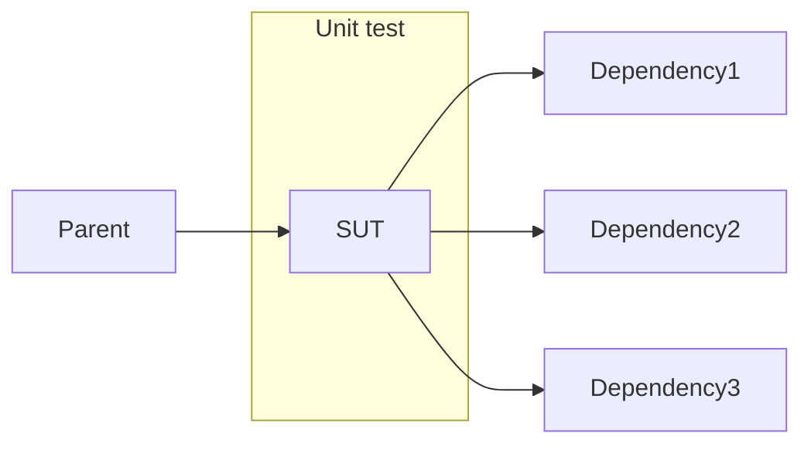

# Unit Testing

- What is a unit test
- What makes a good test
- Good practices to get into

---

# What Is A Unit Test

- Tests a unit, which is normally defined as a class. The class being tested is referred to as the **SUT**: **S**ytem **U**nder **T**est.
- Unit tests consist of 2 or 3 steps:
  - **Arrange**: Typically instantiates the sut and sets up the test.
  - **Act**: Performs the action that is being tested.
  - **Assert**: Checks the function works as expected.

---

Below is an example test. It is common practice to leave code comments outlining the 3 parts of the test:

```csharp
public void Test()
{
  // Arrange
  var sut = new Calculator();

  // Act
  var result = sut.Add(3, 4);

  // Assert
  Assert.Equals(result, 7);
}
```

Tests fail when they throw an exception and pass when they don't. `Assert.Equals` throws when it's 2 params are not equal.

---

  The arrange step is not required in a few circumstances

---

If the class is static the arrange step isn't always required:

```csharp
public void Test()
{
  // Act
  var result = Calculator.Add(3, 4);

  // Assert
  Assert.Equals(result, 7);
}
```

You can still include it if the params to the static method require some logic to create then.

---

If the constructor is the subject of the test, then the instantiation of the SUT belongs in the `Act` part of the test:

```csharp
public void Test()
{
  // Act
  Action act = () => new Calculator(label: null);

  // Assert
  Assert.Throws<ArgumentNullException>(act);
}
```

- Asserting a class throws an exception is tricky as tests fail when an exception is thrown. To get around this we create an `Action` that `Assert.Throws` then invokes.
  - If the expected exception is thrown, it is swallowed to pass the test.
  - If the expected exception isn't thrown, then a different exception is thrown to fail the test.

---

# What Makes A Good Test

- They should be fast
- They should tell the developer exactly what has broken when they fail
- They should be reliable and deterministic
- They should not produce any real-world side-effects
- They be isolated from each other
- They should document how the SUT works

---

# Unit Tests Should Only Invoke SUT



Dependency injection is used to achieve this.

---

# Why Unit Tests Should Only Invoke The SUT

- Before newing up another classes in a class' implementation, remember: `new is glue`
  - If you new an object up, the SUT is now tied to that class
  - Any test will also invoke the class being newed up
- The following C# language features also "glue" your SUT to other implementations:
  - Static classes/methods, including extension methods
  - Base methods when using inheritance

---

# Why Unit Tests Should Only Invoke The SUT

It isn't always bad to tie you class to another implementation.

The question to ask yourself is:

> Do I need to modify the behaviour of this dependency to drive a test?

Some examples where it's ok:

- LINQ extension methods
- Newing up POCOs and DTOs

---

# SUT Using Static Class

```csharp
public class PriceCalculator
{
  public int GetPrice(Customer customer)
  {
    if (CustomerHelper.EligibleForDiscount(customer))
    {
      return customer.Price - 5;
    }
    else
    {
      return customer.Price;
    }
  }
}
```

---

# SUT Using Inheritance

```csharp
public class PriceCalculator : PriceCalculatorBase
{
  public int GetPrice(Customer customer)
  {
    if (base.EligibleForDiscount(customer))
    {
      return customer.Price - 5;
    }
    else
    {
      return customer.Price;
    }
  }
}
```

---

The previous 2 examples exhibit the following bad qualities:

---

- If there is a bug `CustomerHelper` or `PriceCalculatorBase`, then any unit test that invokes them will also fail. This is referred to as a test being "brittle". If lots of tests fail due to a single bug, it is harder to find the cause of the issue.
  - Imagine the `PriceCalculatorBase` class has 20 implementations, a single bug in the base could cause 20 tests to fail.
  - Or imagine the implementation of the `PriceCalculatorBase` changes, we now need to update lots of unit tests for all the implementations.

---

- It's difficult to drive unit tests to cover each path through the `GetPrice` method.
  - Imagine the `GetPrice` method has 50 different ways of checking a customer is eligible for a discount. To fully test and document how the calculator works, we need tests that drive those 50 different scenarios.

---

A pattern called dependency injection is used to overcome this.

---

# Example SUT Using DI

```csharp
public class PriceCalculator : IPriceCalculator
{
  private readonly ICustomerHelper _customerHelper;

  public PriceCalculator(ICustomerHelper customerHelper) => _customerHelper = customerHelper;

  public int GetPrice(Customer customer)
  {
    if (_customerHelper.EligibleForDiscount(customer))
    {
      return customer.Price - 5;
    }
    else
    {
      return customer.Price;
    }
  }
}
```

<small>

- The `PriceCalculator` has an `ICustomerHelper` interface injected into it.
  - This means at runtime we can inject the real `CustomerHelper` that has the complex logic
  - But when testing we can swap that for a dummy class without that logic.

</small>

---

# Example Test That Uses DI

```csharp
public class TrueCustomerHelper : ICustomerHelper
{
  bool EligibleForDiscount(Customer customer) => true;
}

[Fact]
public GetPriceShouldReturnReducedPriceWhenTheCustomerIsEligibleForDiscount()
{
  // Arrange
  var customerHelper = new TrueCustomerHelper();
  var customer = new Customer { Price = 20 };
  vat sut = new PriceCalculator(customerHelper);

  // Act
  var result = sut.GetPrice(customer);

  // Assert
  Assert.Equal(15);
}

```

<small>

The test is annotated with a `[Fact]` attribute. This attribute belongs to the [xUnit](https://xunit.net/) library. It is an open source project that is now the most commonly used unit test framework in .NET.

The test's name should document what the test does in clear language.

</small>

---

Because the `PriceCalculator` takes in an interface, the test can control exactly how the dependencies work and this makes it super easy to drive the test.

In the previous example we created a dummy implementation that drove the test. Creating lots of dummy implementations will quickly become unmanageable. This is where Mocking libraries come in.

---

# Mocks

A mock is a dummy implementation of an interface. [Moq](https://github.com/moq/moq4) is by far the most popular mocking framework in .NET.

Lets rewrite the previous test to use Moq.

---

# Example Test That Uses DI & Moq

```csharp
[Fact]
public GetPriceShouldReturnReducedPriceWhenTheCustomerIsEligibleForDiscount()
{
  // Arrange
  var mockCustomerHelper = new Mock<ICustomerHelper>();
  mockCustomerHelper
    .Setup(m => m.EligibleForDiscount(It.IsAny<Customer>()))
    .Returns(true);
  var customer = new Customer { Price = 20 };
  vat sut = new PriceCalculator(mockCustomerHelper.Object);

  // Act
  var result = sut.GetPrice(customer);

  // Assert
  Assert.Equal(15);
}
```

---

- We create an object of type `Mock<ICustomerHelper>`.
- We use the `Setup` method say which method we want to configure.
  - `It.IsAny` is a method from Moq, we're using it here to say the set up doesn't care what type of customer is passed in.
- We use the `Returns` method to then say what we want to return for the previous set up.
- When injecting the mock into the SUT, we call the Mock object's `.Object` property. This returns the configured mock that can be consumed just like any other `ICustomerHelper`.

---

The test now passes, but what if the implementation was updated to this:

```csharp
public class PriceCalculator : IPriceCalculator
{
  private readonly ICustomerHelper _customerHelper;

  public PriceCalculator(ICustomerHelper customerHelper) => _customerHelper = customerHelper;

  public int GetPrice(Customer customer)
  {
    if (_customerHelper.EligibleForDiscount(new Customer())) // Wrong customer!
    {
      return customer.Price - 5;
    }
    else
    {
      return customer.Price;
    }
  }
}
```

---

Because the test set up doesn't care what instance of customer it gets, it will always return true and this will pass the test.

Usage of `It.IsAny` should be avoided where possible to avoid these kind of bugs slipping through.

We can fix this by updating the test:

```csharp
[Fact]
public GetPriceShouldReturnReducedPriceWhenTheCustomerIsEligibleForDiscount()
{
  // Arrange
  var customer = new Customer { Price = 20 };
  var mockCustomerHelper = new Mock<ICustomerHelper>();
  mockCustomerHelper
    .Setup(m => m.EligibleForDiscount(customer))
    .Returns(true);
  vat sut = new PriceCalculator(mockCustomerHelper.Object);

  // Act
  var result = sut.GetPrice(customer);

  // Assert
  Assert.Equal(15);
}
```

---

Because we've removed `It.IsAny` and replaced it with the actual customer object, the mock now only returns true when it is given the customer object we expect.

---

There is another major feature Moq gives us. It has a method called `Verify`. This method allows you to specify whether or not a mock has been invoked with certain parameters a specified number of times.

This is useful when you want to verify a side-effect occurs correctly. A side effect is something a class does that has an observable impact on the real world, e.g.

- Writes a log entry, we can observe changes in the logs.
- Updates a file, we can observe file changes on disk.
- Modifies some state (like a DB), we can observe the data changing in the DB.
- Makes a web request, we can observe the web traffic on the network.

---

# Example SUT That Causes A Side-Effect

```csharp
public class PriceCalculator : IPriceCalculator
{
  private readonly ILogger _logger;

  public PriceCalculator(ILogger logger) => _logger = logger;

  public string GetName(Customer customer)
  {
    _logger.Log("Retrieved customer");
    return customer.Name;
  }
}
```

---

If the logger is called lots of times we would spam the logs. So we want to **verify** it's only called once. Here's how that is done using Moq:

---

# Example Test That Verifies Mock

```csharp
[Fact]
public GetNameShouldOnlyLogOnce()
{
  // Arrange
  var customer = new Customer { Price = 20 };
  var mockLogger = new Mock<ILogger>();
  vat sut = new PriceCalculator(mockLogger.Object);

  // Act
  sut.GetName(customer);

  // Assert
  mockLogger.Verify(
    m => m.Log("Retrieved customer"),
    Times.Once);
}
```

---

Much like the `Setup` method, the `Verify` method allows you to specify the params you are expecting to be passed to the method. Once you have specified that, you can confirm how many times you expect the method to be ran with those params.

---

- Example of Times.Never, combine both examples, theory?
- Fluent Assertions
